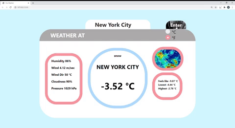

# WeatherAt: city-weather-web-app

## Demo :sunny::cloud::umbrella::snowflake::zap:

## Features & Languages Used
* Enables users to enter their city 
* Displays **current** temperature, short description, humidity, wind speed & direction, cloudness and pressure
* Utilized OpenWeather **API**, **Javascript** & **JSON**, **HTML** and **CSS** 

Last Update (02/18/2021)
